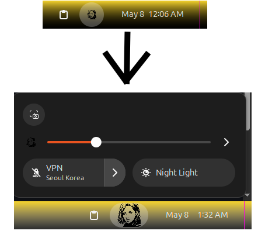

# status-icon-resize


Increases the size of status icons in the quick settings menu in order to see custom icons more clearly.

# quick-settings-icon-size

A GNOME Shell extension that resizes the quick settings panel icon (the volume/profile picture button in the top bar) without affecting other status icons.

## The Problem

GNOME Shell renders the quick settings icon at a fixed small size regardless of panel height. Editing the theme CSS has no effect because the size is overridden at runtime by GNOME Shell's JavaScript layer. This extension works around that by directly setting the icon size after the shell loads.

## Requirements

- GNOME Shell 45–48
- Ubuntu 24.04 LTS or any distro running a compatible GNOME version

## Installation

```bash
git clone https://github.com/yourusername/quick-settings-icon-size.git
cd quick-settings-icon-size
chmod +x status-icon-resize.sh
./status-icon-resize.sh        # default size: 32px
./status-icon-resize.sh 40     # or specify your own size
```

Then **log out and back in** to apply.

## Changing the Size

Just re-run the script with a new value:

```bash
./status-icon-resize.sh 36
```

Then log out and back in.

## Uninstalling

```bash
gnome-extensions disable panel-icon-size@local
rm -rf ~/.local/share/gnome-shell/extensions/panel-icon-size@local
```

Then log out and back in.

## Notes

- Does **not** require Dash to Panel or any other extension
- Does **not** affect other status icons — only the quick settings button
- Do **not** run with `sudo` — the extension installs to your user directory
- Changes survive reboots but will need to be re-applied after GNOME Shell updates
